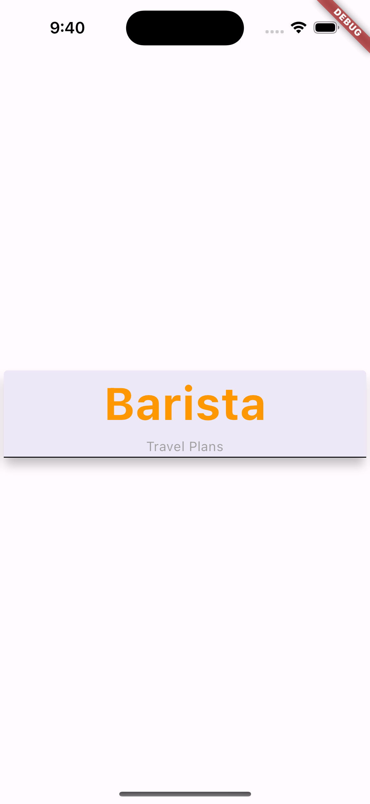

# card_widget

A new Flutter project.

## Getting Started

This project is a starting point for a Flutter Card Widget.

The `"Card"` widget commonly used in the flutter.
To group and lay out the data, the Card is a perfect widget to enhance the look of the UI.

The Card Widget is customizable with properties such as elevation, shape, color, margin and others.

## Example Screenshot 

 
